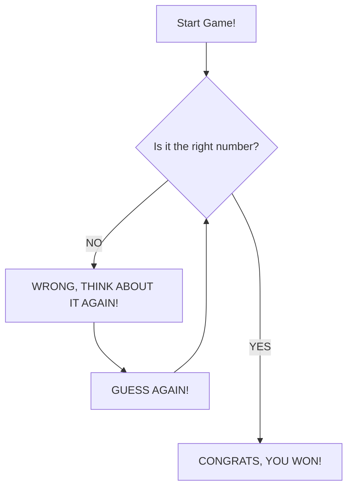

# Guessing Game Flowchart 

```mermaid
flowchart TD
A[Start Game!] --> B{Is it the right number?}
    B -- NO --> C[WRONG, THINK ABOUT IT AGAIN!]
    C --> D[GUESS AGAIN!]
    D --> B
    B -- YES ----> E[CONGRATS, YOU WON!]
```
