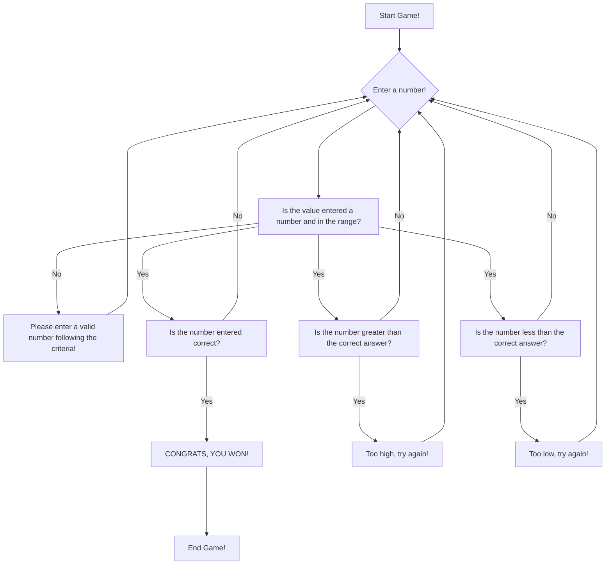

# Guessing Game Flowchart 
## Directions: Answer the prompts correctly, give a number that is in the given range, and is numeric!

## Documentation: 
#### Step 1: First, we ask the user for a number and check if the number is numeric, and if it is within the range of numbers given. 
#### Step 2: If not, then we prompt the user to give another number correctly, and loop through Step 1 again.
#### Step 3: If the number passes the check, then we check for 3 criterias, which are too low, too high, or correct answer. 
#### Step 4: If the number is the correct answer, then we display "CONGRATS, YOU WON!", and end the game! 
#### Step 5: If the number is not the correct answer, we loop back to Step 1. 
#### Step 6: If the number is not the correct answer, we check for wheather the answer is high or low.
#### Step 7: If the number is greater than the correct answer, then display the message, and loop back to Step 1. 
#### Step 8: If the number is less than the correct answer, then display the message, and loop back to Step 1. 
#### Step 9: The game will keep checking all of the criteria before sending it back to Step 1. 
#### Step 10: The game will keep on going until the correct number or answer is guessed! 
