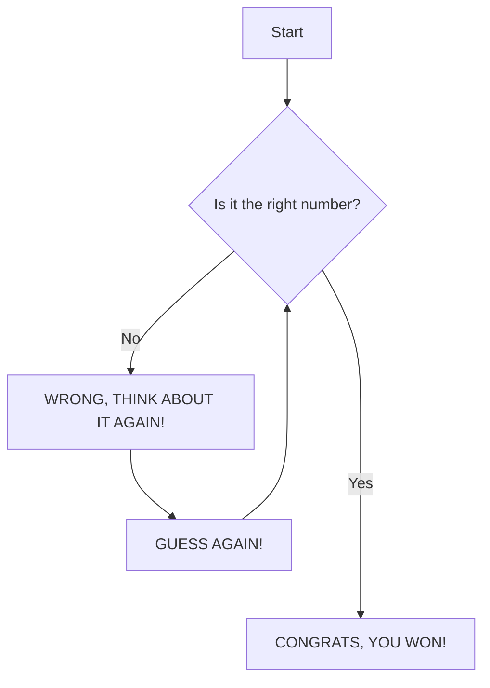

# Guessing Game Flowchart 

```mermaid
flowchart TD
    A[Start] --> B{Is it the right number?}
    B -- No --> C[WRONG, THINK ABOUT IT AGAIN!]
    C --> D[GUESS AGAIN!]
    D --> B
    B -- Yes ----> E[CONGRATS, YOU WON!]
```
